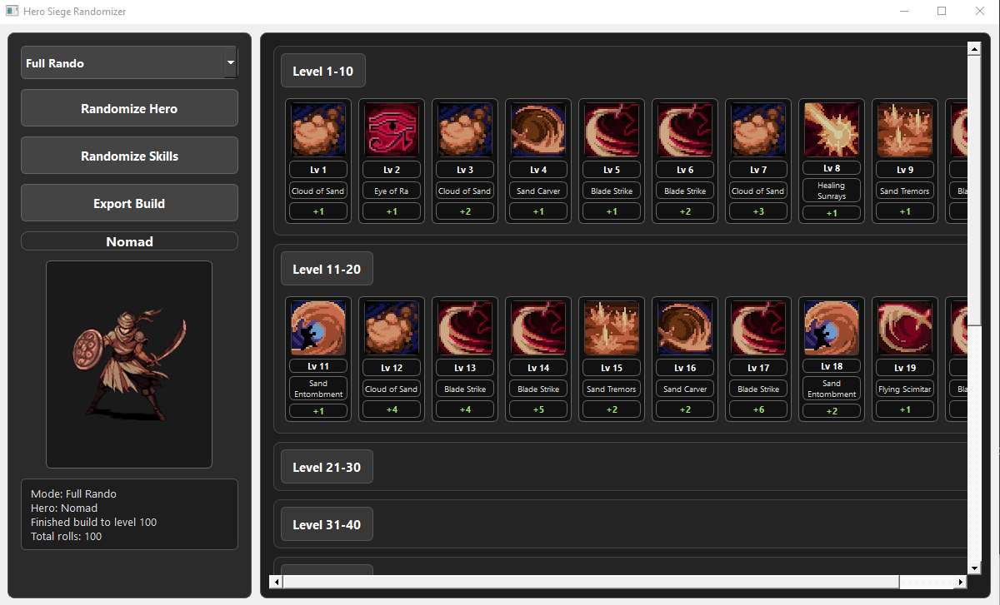
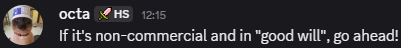

#  Hero Siege Randomizer

---

##  About Me

This is my first ever project, so forgive me if there are errors or jank.

I'm still at the beginner stage where I mostly glue stuff together, ask questions, try things, break things, and somehow make it work xD

I'm always open for feedback or if someone is interested in working together / teaching me something.

---

##  About the Project

This is a small **fan made program for Hero Siege**.

It lets you:
- choose a random hero
- generate random skill builds

Right now it can only generate a full random build from level 1–100, but I plan to keep working on it.

 Important:  
This tool does **NOT** connect to Hero Siege files in any way.  
It’s just a visual randomizer using hero + skill data.

---

## Download

### Option 1
For people who just want to use it:

- Download `HeroSiegeRando.zip`
- Extract it
- Open the folder
- Start `main.exe`

Done 

---

### Option 2 (Code Version)

If you want to look at the code or run it yourself:

- use the provided files

---

## Preview

---

##  Allowed to use?

I asked beforehand if I can share this project since I used hero/skill icons from the game. (This is for now a unconfirmed statement since i wanted to try and look how to set up GitHub)

---

## How does it work?

After starting the program:

### 1. Press **Randomize Hero**
- you will see the selected hero image

### 2. Press **Randomize Skills**

On the right side you will see:
- all generated skills in order
- grouped in level ranges (1–10, 11–20, etc.)

You can:
- click the level range to hide it.

---

###  Export

The export button will:
- save your build as a `.txt` file
- so you can keep or share it later

---

##  Future Ideas

Things I want to add later:

- Import exported builds (right now only export exists)
- More randomization options:
  - randomize specific level range
  - randomize X amount of skills (like 5?)
  - choose hero manually + random skills
- better UI / visuals

---

##  Ideas?

If you have ideas or want something added:

Feel free to message me on Discord ^^